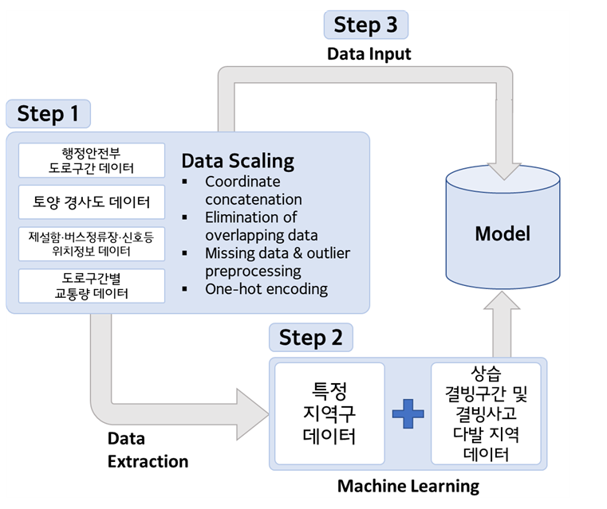
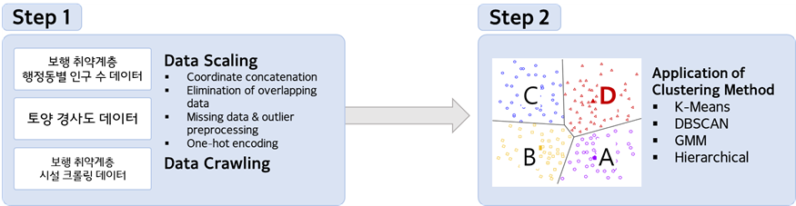
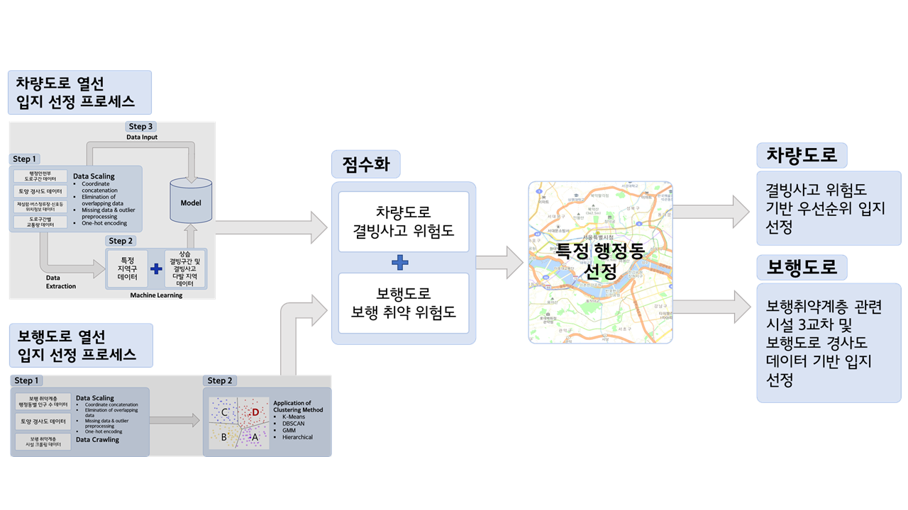

 <h2> 

 ✨ __서울시 도로 열선 시스템 입지 선정__ ✨  
 
 </h2>

__공공빅데이터__ 인턴십 실무형 프로젝트 
2021.08.02 ~ 2021.08.19 17:00 
서울2 38조 
__이채훈, 이주천, 정성훈, 임세준, 이상민, 정선경__
<h1>

__G-BIG HACKATHON__
</h1>

 <h3>
  데이터 기반 행정으로   
  국민의 삶의 질을 개선하라!
  </h3>
  <h2>

  **데이턴십 해커톤 제 4회 우수상 수상작**
  </h2>
  

   
 

  <h2>

 ⚒️ **TECH STACK** 
  </h2>
  
    
    

<h2>

📃 **SUMMARY**
</h2>

<h3> 

**1. 주제 선정 배경**
</h3>
👉 일반 교통 사고 대비 높은 사망률(일반도로 사고 대비 사망률이 3.2배를 상회)
  
👉 보행 취약계층 관련 사고
(낙상사고 발생률이 지속적으로 증가
하지만 관련 정책과 사고 예방 방안은 미흡)
  
<h3> 

**✍ 해결방안으로서의 도로열선**
</h3>
👉 기존 도로 제설제와 비교하였을 때, 도로열선은 매우 친환경적 
👉 성북구, 성동구 시범 설치를 통해, 효과성 검증후 단계적 확대 예정 
👉 설치 기준 문의결과 정확한 기준이 정해져 있지 않음.
  

<h3>

**💣 "머신러닝"을 통해 💣  서울시 도로 열선 설치 명확한 기준 제시**

 

<h2>

⚙️ **PROCESS_VISUALIZATION**
</h2>

<h3>

**차량도로 열선 설치 입지 선정을 위한 프로세스(Case1)**
  

 
 

**보행도로 열선 설치 입지 선정을 위한 프로세스(Case2)**  

 
 
 

**최종도로 열선 설치 입지 선정을 위한 프로세스**  

</h3>
 
<h2>

✏️ **OUTPUT & DATA & CODE**
</h2>
<h4> 자세한 분석 내용은 항목별 링크 내 파일들 참고  

[📕 **OUT PUT**](https://github.com/commanderk9826/G-BIG_HACKATHON_4TH/tree/main/OUTPUT)
 

[📗 **DATA**](https://github.com/commanderk9826/G-BIG_HACKATHON_4TH/tree/main/DATA)
 

[📘 **CODE**](https://github.com/commanderk9826/G-BIG_HACKATHON_4TH/tree/main/DATA/CODE)

</h4>

  

